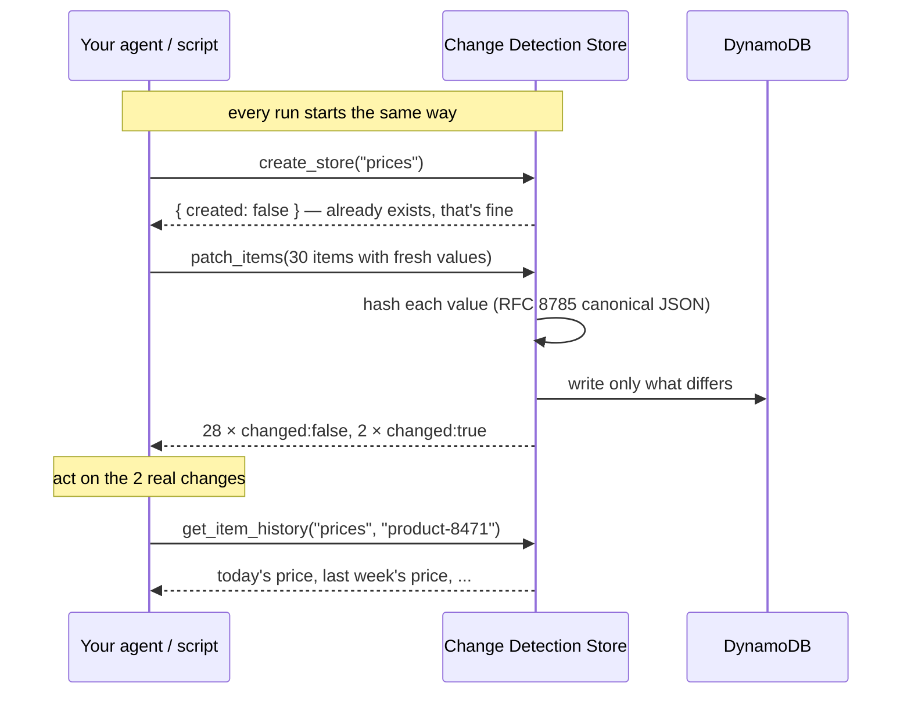
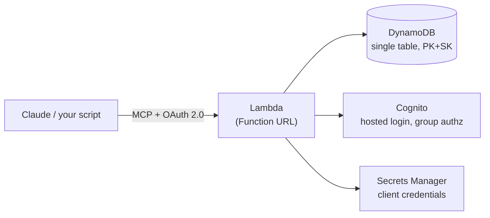

# Change Detection Store

An MCP server that answers one question well: **"has this JSON changed since I last saw it?"**

## Why this exists

Say you want to track prices for a list of products, catch when an API response quietly
changes shape, or watch stock levels across a few shops. The shape of the job is always
the same: fetch the current state, compare it with what you saw last time, act only when
something actually changed.

The fetching part is easy — a cron job, a script, or an LLM agent with a browsing tool.
The remembering-and-comparing part is where projects get messy. Today you'd pick one of:

- **A hand-rolled snapshot store.** A table or a bucket of JSON files, plus comparison
  code you rewrite for every project. Sooner or later it burns you, because the same data
  serialized twice is rarely byte-identical (key order, `1.0` vs `1`) — so you get
  "changes" that aren't.
- **A full monitoring product** like changedetection.io or Visualping. Great when you
  want their fetcher, scheduler and notifications. Overkill when you already own the
  fetching side and only miss the memory.
- **(For agents) pasting the previous value into the prompt** and letting the model do
  the diffing. Works, but you pay tokens for it on every run and the comparison quality
  depends on the model's mood.

This project is the missing middle piece: a small service that _only_ remembers and
compares. Your script or agent sends the current value; the store hashes it canonically,
writes only when the hash differs from last time, and answers `changed: true/false`.
History accumulates real changes only, so "what happened to this key over the last
month" is one call.

To be clear about the scope: **it's a building block, not a monitoring product.** It
doesn't fetch, doesn't schedule, doesn't notify. It remembers and compares — that's the
whole job, and it tries to do that one job properly: canonical hashing, concurrency-safe
writes, a change history that cleans up after itself.

It speaks [MCP](https://modelcontextprotocol.io), so you can add it to Claude as a
custom connector and let the agent call the tools directly — but anything that can do
OAuth and JSON-RPC can talk to it.

## What a run looks like



Twenty-eight of those thirty writes cost nothing — no DynamoDB write, no history entry,
no noise. That asymmetry is the point: polling is cheap, only change is expensive.

## How the change detection works

Values are hashed as SHA-256 over RFC 8785 canonical JSON. In practice:

- key order doesn't matter — `{"a":1,"b":2}` and `{"b":2,"a":1}` are the same value
- number formatting doesn't matter — `1.0`, `1e0` and `1` are the same
- array order DOES matter — `[1,2]` is not `[2,1]`; sort arrays client-side if your
  source returns them in random order

Every patch also takes an optional `meta` field. It's stored every time but never hashed —
put things like `lastSeenAt` in there, so a timestamp doesn't count as a "change".

Deletes are soft: data disappears immediately and DynamoDB TTL removes it physically
within about 7 days. History entries expire after 30 days on their own.

## Architecture



One Lambda serves everything: the MCP endpoint, the OAuth discovery/proxy endpoints and
the JWT gate. Storage is a single DynamoDB table (partition + sort key, no indexes) with
on-demand billing — idle cost is close to zero. There's a CloudWatch dashboard
(`cds-health`) with notes on how to read it, and an SNS topic for alarms.

## Tools

- `create_store` — idempotent; call it at the start of every run, it just says `created: true/false`
- `patch_item` / `patch_items` — the core; batch takes up to 50 items and reports per key
- `get_item` — returns `{ found: false }` for a key that has no value yet (that's normal, not an error)
- `get_item_history` — the change timeline of a key, newest first
- `list_stores`, `list_items`, `delete_item`, `delete_store`

## Running it locally

Node 22 or newer.

```
npm install
npm test                      # unit tests + CDK template assertions
npm run test:integration      # storage contract against DynamoDB Local (needs docker,
                              # or point CDS_DYNAMODB_ENDPOINT at a running instance)
npm run dev --workspace app   # MCP server on http://localhost:3000/mcp, no auth, in-memory
```

Point MCP Inspector at the dev server to poke around.

## Deploying

You need an AWS account and credentials in your shell. Everything lands in `eu-central-1`
(edit `infra/bin/app.ts` for another region).

```
npx cdk bootstrap aws://<account-id>/eu-central-1    # once per account/region
npm run deploy --workspace infra
npm run create-user --workspace scripts -- --email you@example.com
npm run connection-info --workspace scripts
```

The last command prints the MCP URL and the OAuth client id. In Claude:
Settings → Connectors → Add custom connector → paste the URL, put the client id under
Advanced settings, connect, sign in with the user you just created.

Access is a Cognito group (`cds-allowed`) — the create-user script puts people in it.
There's no self-signup, and the app client secret never leaves Secrets Manager.

Cost: close to nothing at low traffic. The KMS key is about a dollar a month; Lambda,
DynamoDB on-demand and Cognito sit in or near their free tiers. Subscribe your email to
the `AlarmTopicArn` stack output if you want to hear about problems.

## Limitations, so you know what you're getting

- **No notifications.** Nothing pushes when a value changes — your client asks. If you
  need push, DynamoDB Streams is the natural extension point.
- **No diffs.** You get the current value and the history; comparing versions is on you.
- Values up to 64 KB after canonicalization, history kept 30 days, list pages of 100.
- Store names: `a-z0-9_-`, 3–12 chars. Item keys also allow `A-Z` and `|`, up to
  32 chars, case-sensitive (external ids like `source|ID6HfGma` fit as-is).
- One shared space: every user in the group sees all stores. No multi-tenancy.
- No web UI — MCP only.
- Concurrency is capped at 10 on purpose: it's a hard cost ceiling for an endpoint
  that's public by nature. Raise `RESERVED_CONCURRENCY` in the api construct if you
  need more.
- Function URL quirk: the 401 challenge comes back as `x-amzn-Remapped-www-authenticate`.
  MCP clients don't care (they use the well-known discovery endpoints), but your curl
  scripts might.

## License

[MIT](LICENSE)
